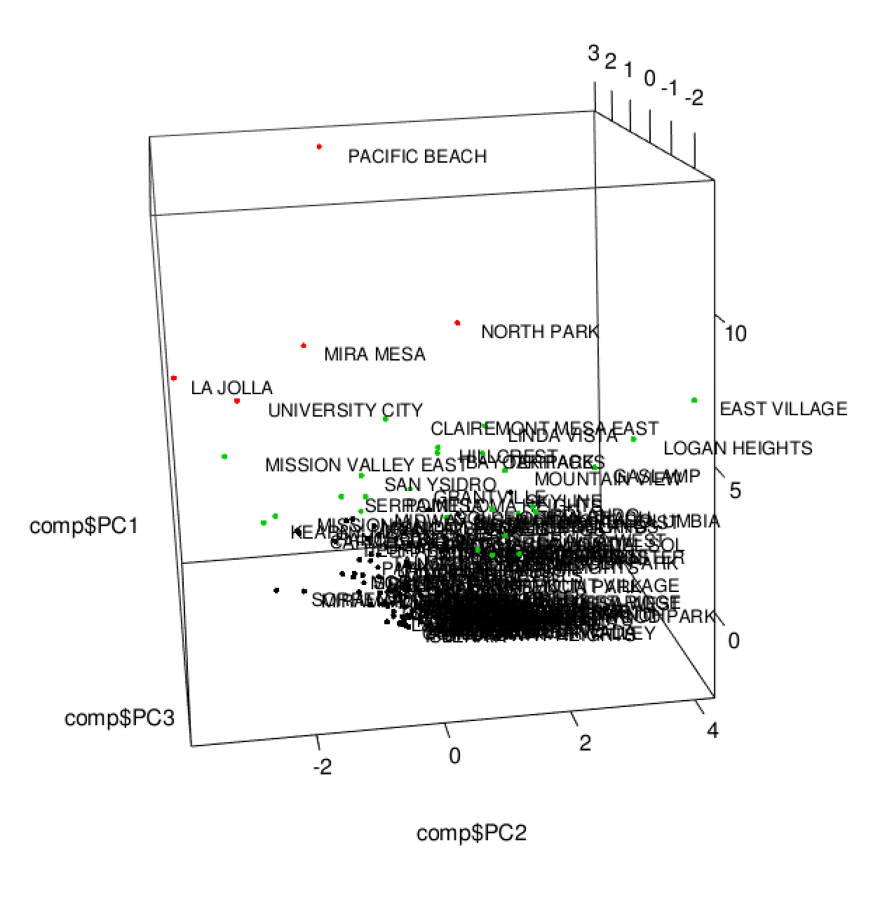

# Analysis of San Diego Neighborhood Crime Counts
### Principal Components Analysis and K Means Clustering in R

## Data

The data was downloaded from the Automated Regional Justice Information System (ARJIS) which provides crime statistics for the City of San Diego ([link to data](https://www.sandiego.gov/sites/default/files/legacy/police/pdf/2014/201412cumneighbor.pdf)). The data is also provided as a .mat file in the Data folder of this repository.  

## Analysis

### Pairwise Scatter plots of Raw Data

Most of the variables below show a positive correlation with one another which in some cases is quite linear. For example, there are strong linear relationships between “$400+ Larceny-Theft” & “Car Prowl” and “ST/ARM (strong-arm) Robbery” & “Aggravated Assault”. The stripes that appear in the “Murder” scatter plots are a result of the variable acting like a categorical one since Murder counts only range from 0-2.

### Principal Components Analysis (PCA)

Using PCA we can determine the variance along different axes of the data and ignore those axes where the variance is very small. We can plot the proportion of variance explained by the resulting principal components to determince how much of it we want to retain.

Since about 90% of the variance can be explained by the first four principal components, we can look more closely at the loadings for these to see how each of our variables are correlated. Bolded values represent variables that contribute strongly to a component - this threshold is determined by calculating what the loadings would be if all variables contributed equally to that principal component.

We can create biplots to visualize the loadings of each crime on the principal components and to see how individual neighborhoods score on the principal components.

### K-Means Clustering

To decide how many clusters to use we can look for the “elbow” in the plot below. This plot shows number of clusters on the x-axis and the corresponding sum of squared error on the y-axis. The elbow is considered the point on the graph at which the sum of squared error decreases abruptly- in this instance we can choose k=3. 

We can use K-Means to cluster the principal components into 3 groups and then we can plot the clustered pairwise scatter plots for the first four components:

We can also label the points with the corresponding neighborhood names and visualize this in 3D:

From these visualizations it appears that the clusters are separated into tiers where one cluster contains the neighborhoods with the highest crime counts, another contains the neighborhoods with lowest crime counts, and the middle tier contains those neighborhoods with crime counts in between the others.

### Future Directions
- Weighting the variables based on how heinous the crime.
- Including attributes for neighborhood population and size. 
